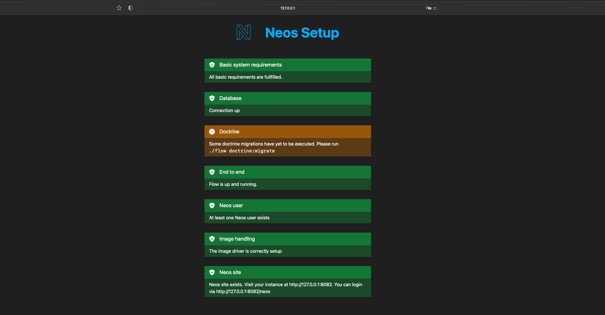

# Neos.Setup

Provides the Flow part of the Neos Setup.

You can use it via 

```sh
./flow setup
```

or by visiting `http://localhost:8081/setup`.



For further information please visit the [docs.neos.io](https://docs.neos.io/guide/installation-development-setup/running-the-setup-tool).

### For us developers

You can find the technical documentation here [Documentation/TechnicalDocumentation](./Documentation/TechnicalDocumentation.md)
